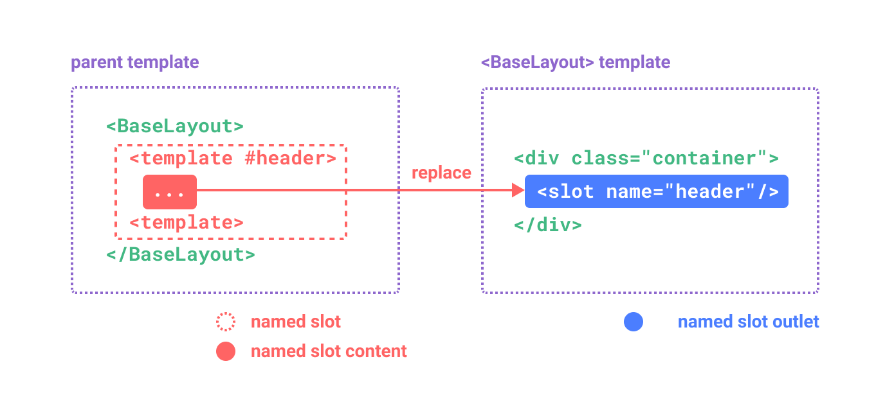

<script setup>
import ListDemo from './component-demos/list-demo/index.vue'
import ButtonCounter from './component-demos/button-counter/index.vue'
</script>

# 组件基础

## 示例

::: details 点击查看示例代码

需要先在项目中安装 [sass](https://www.sass.hk/)，执行 `pnpm add sass -D` 。

::: code-group

```vue [App.vue]
<template>
  <CustomList>
    <CustomListItem
      v-for="item of list"
      :key="item.id"
      :item="item"
      @item-click="handleItemClick"
    >
      <template #footer>
        官网：<span style="color: #1677ff">{{ item.href }}</span>
      </template>
    </CustomListItem>
  </CustomList>
</template>

<script>
import CustomList from './components/CustomList.vue'
import CustomListItem from './components/CustomListItem.vue'

export default {
  components: {
    CustomList,
    CustomListItem
  },
  data() {
    return {
      list: [
        {
          id: 1,
          title: 'Vue',
          content:
            'Vue (发音为 /vjuː/，类似 view) 是一款用于构建用户界面的 JavaScript 框架。它基于标准 HTML、CSS 和 JavaScript 构建，并提供了一套声明式的、组件化的编程模型，帮助你高效地开发用户界面。无论是简单还是复杂的界面，Vue 都可以胜任。',
          href: 'https://cn.vuejs.org'
        },
        {
          id: 3,
          title: 'Ant Design of Vue',
          content:
            '这里是 Ant Design 的 Vue 实现，开发和服务于企业级后台产品。',
          href: 'https://www.antdv.com/docs/vue/introduce-cn'
        },
        {
          id: 2,
          title: 'Vue Router',
          content:
            'Vue Router 是 Vue.js 的官方路由。它与 Vue.js 核心深度集成，让用 Vue.js 构建单页应用变得轻而易举。',
          href: 'https://router.vuejs.org/zh/'
        },
        {
          id: 2,
          title: 'Vuex',
          content:
            'Vuex 是一个专为 Vue.js 应用程序开发的状态管理模式 + 库。它采用集中式存储管理应用的所有组件的状态，并以相应的规则保证状态以一种可预测的方式发生变化。',
          href: 'https://vuex.vuejs.org/zh/'
        }
      ]
    }
  },
  methods: {
    handleItemClick(item) {
      window.open(item.href)
    }
  }
}
</script>
```

```vue [CustomList.vue]
<template>
  <ul class="custom-list">
    <slot></slot>
  </ul>
</template>

<style lang="scss">
.custom-list {
  list-style: none;
  margin: 0;
  padding: 0;
}
</style>
```

```vue [CustomListItem.vue]
<template>
  <li class="custom-list-item" @click="handleItemClick(item)">
    <span class="custom-list-item__header">
      <slot name="header">{{ item.title }}</slot>
    </span>
    <div class="custom-list-item__content">
      <slot>{{ item.content }}</slot>
    </div>
    <div class="custom-list-item__footer">
      <slot name="footer"></slot>
    </div>
  </li>
</template>

<script>
export default {
  props: ['item'],
  methods: {
    handleItemClick() {
      this.$emit('item-click', this.item)
    }
  }
}
</script>

<style lang="scss">
.custom-list-item {
  position: relative;
  padding: 10px 20px;
  border-radius: 3px;
  transition: all 0.3s;
  cursor: pointer;
  &:hover {
    background-color: #f3f3f5;
  }
  &::after {
    content: '';
    position: absolute;
    left: 0;
    bottom: 0;
    width: 100%;
    height: 1px;
    background: #efefef;
  }
  &:last-child::after {
    display: none;
  }
  .custom-list-item__header {
    font-weight: bold;
    font-size: 16px;
  }
  .custom-list-item__content {
    margin: 10px 0;
    font-size: 14px;
  }
  .custom-list-item__footer {
    font-size: 14px;
  }
}
</style>
```

:::

<ListDemo />

## 定义一个组件

当使用构建步骤时，我们一般会将 Vue 组件定义在一个单独的 `.vue` 文件中，这被叫做单文件组件 (简称 SFC)。假设我们把下面定义的组件放在了一个叫做 `ButtonCounter.vue` 的文件中，这个组件将会以默认导出的形式被暴露给外部：

```vue
<template>
  <button @click="count++">You clicked me {{ count }} times.</button>
</template>

<script>
export default {
  data() {
    return {
      count: 0
    }
  }
}
</script>
```

## 使用组件

要使用一个子组件，我们首先需要在父组件中导入它。然后在**选项式写法**中需要使用 `components` 选项注册它，而在 **`<script setup>`** 中可以直接在模板中使用：

::: code-group

```vue [选项式]
<template>
  <h1>Here is a child component!</h1>
  <ButtonCounter />
  <ButtonCounter />
  <ButtonCounter />
</template>

<script>
import ButtonCounter from './ButtonCounter.vue'

export default {
  components: {
    ButtonCounter
  }
}
</script>
```

```vue [组合式]
<template>
  <h1>Here is a child component!</h1>
  <ButtonCounter />
  <ButtonCounter />
  <ButtonCounter />
</template>

<script setup>
import ButtonCounter from './ButtonCounter.vue'
</script>
```

:::

<ButtonCounter />

## 组件名格式

推荐使用 PascalCase 作为组件名的注册格式，这是因为：

1. PascalCase 是合法的 JavaScript 标识符。这使得在 JavaScript 中导入和注册组件都很容易，同时 IDE 也能提供较好的自动补全。

2. `<PascalCase />` 在模板中更明显地表明了这是一个 Vue 组件，而不是原生 HTML 元素。同时也能够将 Vue 组件和自定义元素 (web components) 区分开来。

为了方便，Vue 支持将模板中使用 kebab-case 的标签解析为使用 PascalCase 注册的组件。这意味着一个以 `MyComponent` 为名注册的组件，在模板中可以通过 `<MyComponent>` 或 `<my-component>` 引用。这让我们能够使用同样的 JavaScript 组件注册代码来配合不同来源的模板。

## Props 声明

一个组件需要显式声明它所接受的 props，这样 Vue 才能知道外部传入的哪些是 props，哪些是透传 attribute。

在**选项式写法**中 props 需要使用 `props` 选项来定义，而在 **`<script setup>`** 可以使用 `defineProps()` 宏来声明：

:::code-group

```js [选项式]
export default {
  props: ['foo'],
  created() {
    // props 会暴露到 `this` 上
    console.log(this.foo)
  }
}
```

```js [组合式]
const props = defineProps(['foo'])

console.log(props.foo)
```

:::

除了使用字符串数组来声明 prop 外，还可以使用对象的形式：

:::code-group

```js [选项式]
export default {
  props: {
    title: String,
    likes: {
      type: Number,
      default: 100
    }
  }
}
```

```js [组合式]
defineProps({
  title: String,
  likes: {
    type: Number,
    default: 100
  }
})
```

:::

`type` 可以是下列这些原生构造函数：

- `String`
- `Number`
- `Boolean`
- `Array`
- `Object`
- `Date`
- `Function`
- `Symbol`
- `Error`

## Props 名字格式

如果一个 prop 的名字很长，应使用 camelCase 形式，因为它们是合法的 JavaScript 标识符，可以直接在模板的表达式中使用，也可以避免在作为属性 key 名时必须加上引号。

::: code-group

```js [选项式]
export default {
  props: {
    greetingMessage: String
  }
}
```

```js [组合式]
defineProps({
  greetingMessage: String
})
```

:::

```vue-html
<span>{{ greetingMessage }}</span>
```

虽然理论上可以在向子组件传递 props 时使用 camelCase 形式 (使用 DOM 内模板)，但实际上为了和 HTML attribute 对齐，我们通常会将其写为 kebab-case 形式：

```vue-html
<MyComponent greeting-message="hello" />
```

对于组件名我们推荐使用 PascalCase，因为这提高了模板的可读性，能帮助我们区分 Vue 组件和原生 HTML 元素。然而对于传递 props 来说，使用 camelCase 并没有太多优势，因此我们推荐更贴近 HTML 的书写风格。

## 单向数据流

所有的 props 都遵循着**单向绑定**原则，props 因父组件的更新而变化，自然地将新的状态向下流往子组件，而不会逆向传递。这避免了子组件意外修改父组件的状态的情况，不然应用的数据流将很容易变得混乱而难以理解。

另外，每次父组件更新后，所有的子组件中的 props 都会被更新到最新值，这意味着**不应该**在子组件中去更改一个 prop。若这么做了，Vue 会在控制台上抛出警告：

::: code-group

```js [选项式]
export default {
  props: ['foo'],
  created() {
    // ❌ 警告！prop 是只读的！
    this.foo = 'bar'
  }
}
```

```js [组合式]
const props = defineProps(['foo'])

// ❌ 警告！prop 是只读的！
props.foo = 'bar'
```

:::

### 更改对象 / 数组类型的 props

当对象或数组作为 props 被传入时，虽然子组件无法更改 props 绑定，但仍然**可以**更改对象或数组内部的值，这是因为 JavaScript 的对象和数组是按引用传递。在最佳实践中，你应该尽可能避免这样的更改，除非父子组件在设计上本来就需要紧密耦合。在大多数场景下，子组件应该抛出一个事件来通知父组件做出改变。

## Props 校验

Vue 组件可以更细致地声明对传入的 props 的校验要求。比如我们上面已经看到过的类型声明，如果传入的值不满足类型要求，Vue 会在浏览器控制台中抛出警告来提醒使用者。这在开发给其他开发者使用的组件时非常有用。

要声明对 props 的校验，提供一个带有 props 校验选项的对象，例如：

::: code-group

```js [选项式]
export default {
  props: {
    // 基础类型检查
    //（给出 `null` 和 `undefined` 值则会跳过任何类型检查）
    propA: Number,
    // 多种可能的类型
    propB: [String, Number],
    // 必传，且为 String 类型
    propC: {
      type: String,
      required: true
    },
    // Number 类型的默认值
    propD: {
      type: Number,
      default: 100
    },
    // 对象类型的默认值
    propE: {
      type: Object,
      // 对象或者数组应当用工厂函数返回。
      // 工厂函数会收到组件所接收的原始 props
      // 作为参数
      default(rawProps) {
        return { message: 'hello' }
      }
    },
    // 自定义类型校验函数
    // 在 3.4+ 中完整的 props 作为第二个参数传入
    propF: {
      validator(value, props) {
        // The value must match one of these strings
        return ['success', 'warning', 'danger'].includes(value)
      }
    },
    // 函数类型的默认值
    propG: {
      type: Function,
      // 不像对象或数组的默认，这不是一个
      // 工厂函数。这会是一个用来作为默认值的函数
      default() {
        return 'Default function'
      }
    }
  }
}
```

```js [组合式]
defineProps({
  // 基础类型检查
  // （给出 `null` 和 `undefined` 值则会跳过任何类型检查）
  propA: Number,
  // 多种可能的类型
  propB: [String, Number],
  // 必传，且为 String 类型
  propC: {
    type: String,
    required: true
  },
  // Number 类型的默认值
  propD: {
    type: Number,
    default: 100
  },
  // 对象类型的默认值
  propE: {
    type: Object,
    // 对象或数组的默认值
    // 必须从一个工厂函数返回。
    // 该函数接收组件所接收到的原始 prop 作为参数。
    default(rawProps) {
      return { message: 'hello' }
    }
  },
  // 自定义类型校验函数
  // 在 3.4+ 中完整的 props 作为第二个参数传入
  propF: {
    validator(value, props) {
      // The value must match one of these strings
      return ['success', 'warning', 'danger'].includes(value)
    }
  },
  // 函数类型的默认值
  propG: {
    type: Function,
    // 不像对象或数组的默认，这不是一个
    // 工厂函数。这会是一个用来作为默认值的函数
    default() {
      return 'Default function'
    }
  }
})
```

:::

一些补充细节：

- 所有 prop 默认都是可选的，除非声明了 `required: true`。

- 除 `Boolean` 外的未传递的可选 prop 将会有一个默认值 `undefined`。

- `Boolean` 类型的未传递 prop 将被转换为 `false`。这可以通过为它设置 `default` 来更改——例如：设置为 `default: undefined` 将与非布尔类型的 prop 的行为保持一致。

- 如果声明了 `default` 值，那么在 prop 的值被解析为 `undefined` 时，无论 prop 是未被传递还是显式指明的 `undefined`，都会改为 `default` 值。

当 prop 的校验失败后，Vue 会抛出一个控制台警告 (在开发模式下)。

## 触发与监听事件

在组件的模板表达式中，可以直接使用 `$emit` 方法触发自定义事件 (例如：在 `v-on` 的处理函数中)：

```vue-html
<!-- MyComponent -->
<button @click="$emit('someEvent')">click me</button>
```

父组件可以通过 `v-on` (缩写为 `@`) 来监听事件：

```vue-html
<MyComponent @some-event="callback" />
```

像组件与 prop 一样，事件的名字也提供了自动的格式转换。注意这里我们触发了一个以 camelCase 形式命名的事件，但在父组件中可以使用 kebab-case 形式来监听。与 prop 大小写格式一样，在模板中我们也推荐使用 kebab-case 形式来编写监听器。

## 事件参数 {#event-arguments}

有时候我们会需要在触发事件时附带一个特定的值。这种场景下，我们可以给 `$emit` 提供一个额外的参数：

```vue-html
<button @click="$emit('increaseBy', 1)">
  Increase by 1
</button>
```

然后我们在父组件中监听事件，我们可以先简单写一个内联的箭头函数作为监听器，此函数会接收到事件附带的参数：

```vue-html
<MyButton @increase-by="(n) => count += n" />
```

::: tip 提示
所有传入 `$emit()` 的额外参数都会被直接传向监听器。举例来说，`$emit('foo', 1, 2, 3)` 触发后，监听器函数将会收到这三个参数值。
:::

## 声明触发的事件

在**选项式写法**中 组件可以显式地通过 `emits` 选项来声明它要触发的事件，而在 **`<script setup>`** 可以使用 `defineEmits()` 宏来声明：

::: code-group

```js [选项式]
export default {
  emits: ['inFocus', 'submit']
}
```

```js [组合式]
const emit = defineEmits(['inFocus', 'submit'])

const handleClick = () => {
  emit('submit')
}
```

:::

`emits` 选项和 `defineEmits()` 宏还支持对象语法。它允许我们对触发事件的参数进行验证，通过返回一个布尔值来检查事件是否合法：

::: code-group

```js [选项式]
export default {
  emits: {
    submit: ({ email, password }) => {
      if (email && password) {
        return true
      } else {
        console.warn('Invalid submit event payload!')
        return false
      }
    }
  }
}
```

```js [组合式]
const emit = defineEmits({
  submit: ({ email, password }) => {
    if (email && password) {
      return true
    } else {
      console.warn('Invalid submit event payload!')
      return false
    }
  }
})
```

:::

尽管事件声明是可选的，我们还是推荐你完整地声明所有要触发的事件，以此在代码中作为文档记录组件的用法。同时，事件声明能让 Vue 更好地将事件和透传 attribute 作出区分，从而避免一些由第三方代码触发的自定义 DOM 事件所导致的边界情况。

:::tip
如果一个原生事件的名字 (例如 `click`) 被定义在 `emits` 选项中，则监听器只会监听组件触发的 `click` 事件而不会再响应原生的 `click` 事件。
:::

## 组件 `v-model`

`v-model` 可以在组件上使用以实现双向绑定。

首先让我们回忆一下 `v-model` 在原生元素上的用法：

```vue-html
<input v-model="searchText" />
```

上面的代码其实等价于下面这段：

```vue-html
<input
  :value="searchText"
  @input="searchText = $event.target.value"
/>
```

而当使用在一个组件上时，`v-model` 会被展开为如下的形式：

```vue-html
<CustomInput
  :model-value="searchText"
  @update:model-value="newValue => searchText = newValue"
/>
```

要让这个例子实际工作起来，`<CustomInput>` 组件内部需要做两件事：

1. 将内部原生 `<input>` 元素的 `value` attribute 绑定到 `modelValue` prop
2. 当原生的 `input` 事件触发时，触发一个携带了新值的 `update:modelValue` 自定义事件

这里是相应的代码：

::: code-group

```vue [选项式]
<!-- CustomInput.vue -->
<template>
  <input
    :value="modelValue"
    @input="$emit('update:modelValue', $event.target.value)"
  />
</template>

<script>
export default {
  props: ['modelValue'],
  emits: ['update:modelValue']
}
</script>
```

```vue [组合式]
<!-- CustomInput.vue -->
<template>
  <input
    :value="modelValue"
    @input="$emit('update:modelValue', $event.target.value)"
  />
</template>

<script setup>
defineProps(['modelValue'])

defineEmits(['update:modelValue'])
</script>
```

:::

现在 `v-model` 可以在这个组件上正常工作了：

```vue-html
<CustomInput v-model="searchText" />
```

另一种在组件内实现 `v-model` 的方式是使用一个可写的，同时具有 getter 和 setter 的 `computed` 属性。`get` 方法需返回 `modelValue` prop，而 `set` 方法需触发相应的事件：

::: code-group

```vue [选项式]
<!-- CustomInput.vue -->
<template>
  <input v-model="value" />
</template>

<script>
export default {
  props: ['modelValue'],
  emits: ['update:modelValue'],
  computed: {
    value: {
      get() {
        return this.modelValue
      },
      set(value) {
        this.$emit('update:modelValue', value)
      }
    }
  }
}
</script>
```

```vue [组合式]
<!-- CustomInput.vue -->
<template>
  <input v-model="value" />
</template>

<script setup>
import { computed } from 'vue'

const props = defineProps(['modelValue'])

const emit = defineEmits(['update:modelValue'])

const value = computed({
  get: () => {
    return props.modelValue
  },
  set: (value) => {
    emit('update:modelValue', value)
  }
})
</script>
```

:::

## `v-model` 的参数

组件上的 `v-model` 也可以接受一个参数：

```vue-html
<MyComponent v-model:title="bookTitle" />
```

在这种情况下，子组件应该使用 `title` prop 和 `update:title` 事件来更新父组件的值，而非默认的 `modelValue` prop 和 `update:modelValue` 事件：

::: code-group

```vue [选项式]
<!-- MyComponent.vue -->
<template>
  <input
    type="text"
    :value="title"
    @input="$emit('update:title', $event.target.value)"
  />
</template>

<script>
export default {
  props: ['title'],
  emits: ['update:title']
}
</script>
```

```vue [组合式]
<!-- MyComponent.vue -->
<template>
  <input
    type="text"
    :value="title"
    @input="$emit('update:title', $event.target.value)"
  />
</template>

<script setup>
defineProps(['title'])

defineEmits(['update:title'])
</script>
```

:::

## 透传 Attributes

“透传 attribute”指的是传递给一个组件，却没有被该组件声明为 props 或 emits 的 attribute 或者 `v-on` 事件监听器。最常见的例子就是 `class`、`style` 和 `id`。

当一个组件以单个元素为根作渲染时，透传的 attribute 会自动被添加到根元素上。举例来说，假如我们有一个 `<MyButton>` 组件，它的模板长这样：

```vue-html
<!-- <MyButton> 的模板 -->
<button>click me</button>
```

一个父组件使用了这个组件，并且传入了 `class`：

```vue-html
<MyButton class="large" />
```

最后渲染出的 DOM 结果是：

```html
<button class="large">click me</button>
```

这里，`<MyButton>` 并没有将 `class` 声明为一个它所接受的 prop，所以 `class` 被视作透传 attribute，自动透传到了 `<MyButton>` 的根元素上。

### 对 `class` 和 `style` 的合并

如果一个子组件的根元素已经有了 `class` 或 `style` attribute，它会和从父组件上继承的值合并。如果我们将之前的 `<MyButton>` 组件的模板改成这样：

```vue-html
<!-- <MyButton> 的模板 -->
<button class="btn">click me</button>
```

则最后渲染出的 DOM 结果会变成：

```html
<button class="btn large">click me</button>
```

### `v-on` 监听器继承

同样的规则也适用于 `v-on` 事件监听器：

```vue-html
<MyButton @click="onClick" />
```

`click` 监听器会被添加到 `<MyButton>` 的根元素，即那个原生的 `<button>` 元素之上。当原生的 `<button>` 被点击，会触发父组件的 `onClick` 方法。同样的，如果原生 `button` 元素自身也通过 `v-on` 绑定了一个事件监听器，则这个监听器和从父组件继承的监听器都会被触发。

## 插槽内容与出口

在之前的章节中，我们已经了解到组件能够接收任意类型的 JavaScript 值作为 props，但组件要如何接收模板内容呢？在某些场景中，我们可能想要为子组件传递一些模板片段，让子组件在它们的组件中渲染这些片段。

举例来说，这里有一个 `<FancyButton>` 组件，可以像这样使用：

```vue-html{2}
<FancyButton>
  Click me! <!-- 插槽内容 -->
</FancyButton>
```

而 `<FancyButton>` 的模板是这样的：

```vue-html{2}
<button class="fancy-btn">
  <slot></slot> <!-- 插槽出口 -->
</button>
```

`<slot>` 元素是一个**插槽出口** (slot outlet)，标示了父元素提供的**插槽内容** (slot content) 将在哪里被渲染。


## 默认内容

在外部没有提供任何内容的情况下，可以为插槽指定默认内容。比如有这样一个 `<SubmitButton>` 组件：

```vue-html
<button type="submit">
  <slot></slot>
</button>
```

如果我们想在父组件没有提供任何插槽内容时在 `<button>` 内渲染“Submit”，只需要将“Submit”写在 `<slot>` 标签之间来作为默认内容：

```vue-html{3}
<button type="submit">
  <slot>
    Submit <!-- 默认内容 -->
  </slot>
</button>
```

现在，当我们在父组件中使用 `<SubmitButton>` 且没有提供任何插槽内容时：

```vue-html
<SubmitButton />
```

“Submit”将会被作为默认内容渲染：

```html
<button type="submit">Submit</button>
```

但如果我们提供了插槽内容：

```vue-html
<SubmitButton>Save</SubmitButton>
```

那么被显式提供的内容会取代默认内容：

```html
<button type="submit">Save</button>
```

## 具名插槽

有时在一个组件中包含多个插槽出口是很有用的。举例来说，在一个 `<BaseLayout>` 组件中，有如下模板：

```vue-html
<div class="container">
  <header>
    <!-- 标题内容放这里 -->
  </header>
  <main>
    <!-- 主要内容放这里 -->
  </main>
  <footer>
    <!-- 底部内容放这里 -->
  </footer>
</div>
```

对于这种场景，`<slot>` 元素可以有一个特殊的 attribute `name`，用来给各个插槽分配唯一的 ID，以确定每一处要渲染的内容：

```vue-html
<div class="container">
  <header>
    <slot name="header"></slot>
  </header>
  <main>
    <slot></slot>
  </main>
  <footer>
    <slot name="footer"></slot>
  </footer>
</div>
```

这类带 `name` 的插槽被称为具名插槽 (named slots)。没有提供 `name` 的 `<slot>` 出口会隐式地命名为“default”。

在父组件中使用 `<BaseLayout>` 时，我们需要一种方式将多个插槽内容传入到各自目标插槽的出口。此时就需要用到**具名插槽**了：

要为具名插槽传入内容，我们需要使用一个含 `v-slot` 指令的 `<template>` 元素，并将目标插槽的名字传给该指令：

```vue-html
<BaseLayout>
  <template v-slot:header>
    <!-- header 插槽的内容放这里 -->
  </template>
</BaseLayout>
```

`v-slot` 有对应的简写 `#`，因此 `<template v-slot:header>` 可以简写为 `<template #header>`。其意思就是“将这部分模板片段传入子组件的 header 插槽中”。



<!-- https://www.figma.com/file/2BhP8gVZevttBu9oUmUUyz/named-slot -->

下面我们给出完整的、向 `<BaseLayout>` 传递插槽内容的代码，指令均使用的是缩写形式：

```vue-html
<BaseLayout>
  <template #header>
    <h1>Here might be a page title</h1>
  </template>

  <template #default>
    <p>A paragraph for the main content.</p>
    <p>And another one.</p>
  </template>

  <template #footer>
    <p>Here's some contact info</p>
  </template>
</BaseLayout>
```

当一个组件同时接收默认插槽和具名插槽时，所有位于顶级的非 `<template>` 节点都被隐式地视为默认插槽的内容。所以上面也可以写成：

```vue-html
<BaseLayout>
  <template #header>
    <h1>Here might be a page title</h1>
  </template>

  <!-- 隐式的默认插槽 -->
  <p>A paragraph for the main content.</p>
  <p>And another one.</p>

  <template #footer>
    <p>Here's some contact info</p>
  </template>
</BaseLayout>
```

现在 `<template>` 元素中的所有内容都将被传递到相应的插槽。最终渲染出的 HTML 如下：

```html
<div class="container">
  <header>
    <h1>Here might be a page title</h1>
  </header>
  <main>
    <p>A paragraph for the main content.</p>
    <p>And another one.</p>
  </main>
  <footer>
    <p>Here's some contact info</p>
  </footer>
</div>
```

## 作用域插槽

在某些场景下插槽的内容可能想要同时使用父组件域内和子组件域内的数据。要做到这一点，我们需要一种方法来让子组件在渲染时将一部分数据提供给插槽。

可以像对组件传递 props 那样，向一个插槽的出口上传递 attributes：

```vue-html
<!-- <MyComponent> 的模板 -->
<div>
  <slot :text="greetingMessage" :count="1"></slot>
</div>
```

当需要接收插槽 props 时，默认插槽和具名插槽的使用方式有一些小区别。下面我们将先展示默认插槽如何接受 props，通过子组件标签上的 v-slot 指令，直接接收到了一个插槽 props 对象：

```vue-html
<MyComponent v-slot="slotProps">
  {{ slotProps.text }} {{ slotProps.count }}
</MyComponent>
```


子组件传入插槽的 props 作为了 `v-slot` 指令的值，可以在插槽内的表达式中访问。
